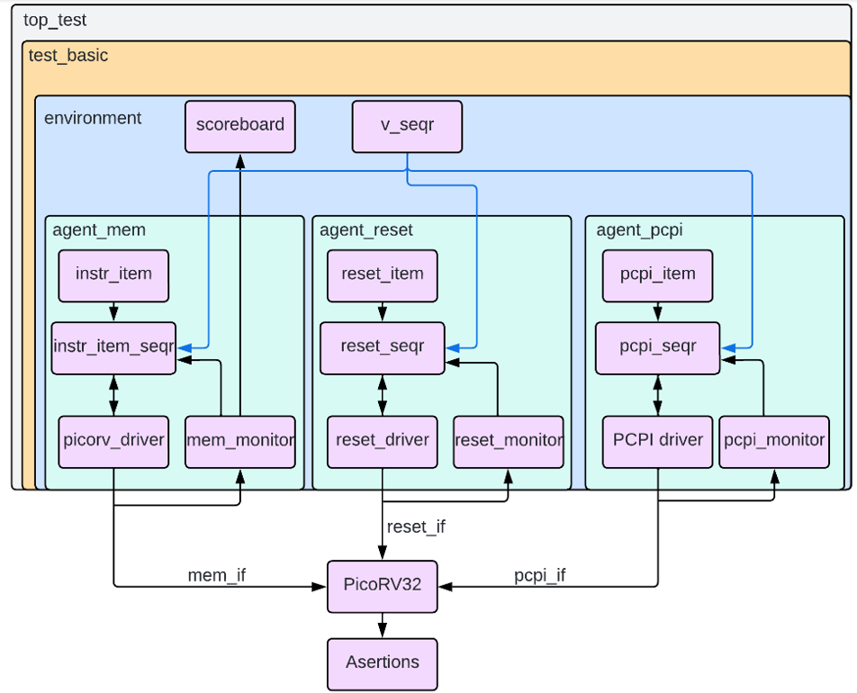
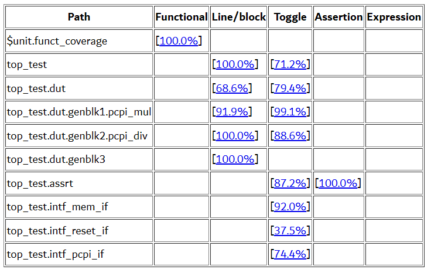

# Proyecto Eléctrico: Verificación funcional del diseño PicoRV32-IMC

#### Tabla de contenidos
- [Descripción](#Descripción)
- [Contenido del repositorio](#contenido-del-repositorio)
- [Instrucciones para correr la simulación](#instrucciones-para-correr-la-simulación)
- [Resultados de las simulaciones](#resultados-de-las-simulaciones)

## Descripción

Este repositorio contiene los archivos del proyecto verificación funcional del diseño PicoRV-32IM, realizado para el curso IE0499 - Proyecto Eléctrico, de la Universidad de Costa Rica.  
Para mas información sobre el PicoRV32-IMC, puede visitar el 
[repositorio oficial](https://github.com/YosysHQ/picorv32?tab=readme-ov-file#features-and-typical-applications).
El entorno de verificación se detalla en la siguiente figura:

## Contenido del repositorio

### doc
En esta carpeta se puede encontrar la documentación asociada a este proyecto. Incluyendo el plan de verificación, la [especificación oficial del conjunto de instrucciones de RiscV](https://riscv.org/wp-content/uploads/2017/05/riscv-spec-v2.2.pdf) y las bitarcoras entregadas durante la realización del proyecto.
### dut
La carpeta dut contiene los archivos relacionados a la configuración del ambiente de verificación de Dsim Desktop así como los archivos fuente .v del picorv.
### test
La carpeta test contiene todos los archivos del ambiente de verificación y de UVM. También contiene la base de datos y los reportes de la última simulación realizada.

## Instrucciones para correr la simulación
En este proyecto se realizó un entorno de verificación con la capacidad de testear el conjunto de instrucciones I y M de RISCV implementadas en el PicoRV. Como función principal, el codigo puede generar de forma aleatoria la cantidad de instrucciones que se desee, siendo 400 000 el valor máximo testeado. Si se desea correr una simulación, se puede seguir los siguientes pasos:
- Primero se debe abrir el archivo "picorv_tb.dpf" usando la extensión [Dsim Desktop](https://marketplace.visualstudio.com/items?itemName=metrics-design-automation.dsim-desktop) disponible para Visual Studio Code.
- Dentro del ambiente existen 3 posible simulaciones a realizar:
    - sim_included: Ejecutará la simulación basandose en el archivo "testbench_ez.v" proporcionado por los autores del diseño.
    - sim_uvm: Esta simulación realizara de forma completa la generación de instrucciones para enviarlas al dut, también hará uso del modelo de referencia implementado para comprobar la correcta funcionalidad de estas instrucciones. La cantidad de instrucciones que se desee generar se puede modificar con la variable "instr_max" de la clase "instr_item_seq" ubicada en el documento "picorv_driver.sv".  
    También se implementó una memoria que permite conservar datos de la misma forma en la que se realizaría en un entorno real, esto resulta especialmente util para el siguiente tipo de test.
    - sim_from_document: Esta simulación permite cargar instrucciones desde el documento "instruction_source.txt". Para ello solo se deben agregar las instrucciones en hexadecimal y una por linea. Es importante mencionar que el ambiente de verificación y el modelo no son muy complejos, por lo que si se utiliza alguna instrucción no contemplada en estos conjuntos de instrucciones, se podrían producir errores,
- Los ultimos dos tipos de simulaciones generarán un archivo llamado "instruction_history.txt" que contiene la lista de todas las instrucciones que se ejecutaron en la última simulación, acompañadas de una descripción en la misma linea de cada instruccion.

El archivo de configuración de ambas simulaciones se pueden modificar para generar waveform y bases de datos con los resultados de la cobertura funcional, de línea, toggle y aserciones según se desee para cada caso en específico. En la página oficial de [Dsim Desktop](https://help.metrics.ca/support/solutions) se puede encontrar información sobre estas configuraciones y cómo poder generar reportes con los resultados obtenidos.

### Resultados de las simulaciones
Como objetivo de este proyecto se buscaba realizar una simulación completa que permitiera alcanzar el 100% de cobertura funcional y el mayor porcentaje posible de cobertura de linea y de toggle (según se detalla en el plan de verificación). Por ello se realizaron varias simulaciones separadas de 400 000 instrucciones, y se generó un reporte de resultados con la última de estas simulaciones. Este reporte se puede encontrar en formato .html en la carpeta test/coverage_report_full/.

    

En la anterior imagen se pueden observar los resultados obtenidos. Se observa que se alcazó un 100% de cobertura funcional y un 100% en las asersiones establecidas. Para el caso de la cobertura de linea y de toggle, en cada uno de los documentos individuales de cada componente se detalla la justificación del porqué no se pudo alcanzar el 100% para estas coberturas. Sin embargo, en la mayoría de los casos esto se dio porque se tenía codigo que se ejecutada bajo otras condiciones según los parámetros que se establecieran, o por funcionalidades fuera de este test, como traps o el uso de instrucciones comprimidas.

